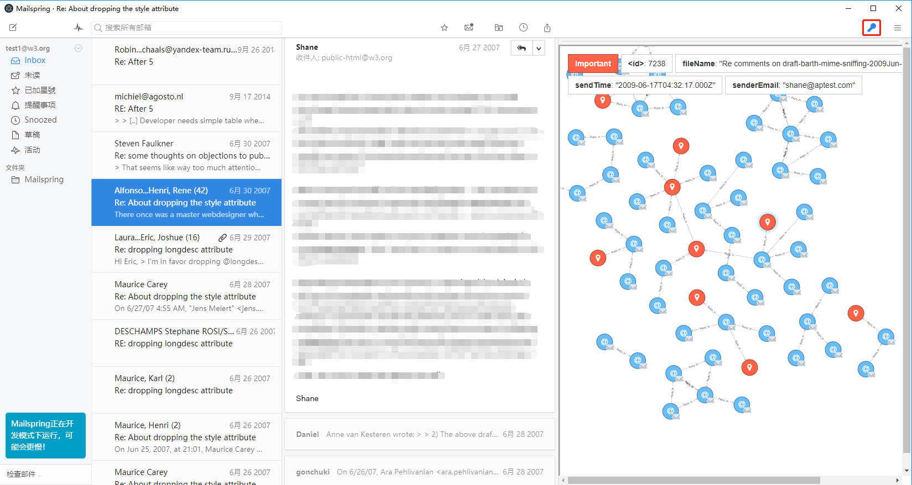

## n1-threadNetwork

### The Thread View Plugin for Mailspring

The threadNetwork plugin provides a thread view of emails of mailbox. We can enter or close the email thread view by clicking on the key shaped toolbar in the upper right corner of the client. In the thread view, a new module "thread sidebar" will be created in the right part of the MessageList to display the thread network structure of all of the messages. You can adjust the view structure by scaling and dragging the size of the thread sidebar. When email node is clicked, some information about the email will be displayed in the upper part of the thread sidebar and details of the email will be displayed in the left. The red node in the network is the important message obtained by the EmailRank algorithm. The thread view and the identified important messages help us to clearly see the development of different threads.

## Usage

## How to work

### Neo4jd3 installation
1.Download the neo4jd3 floder from the project.

2.Follow the README.md of the floder to installation neo4jd3

3.prepare the data in Neo4j data format or D3.js data format

### Plugin installation
1. Download and unzip `n1-threadNetwork.zip` from the [Releases page](https://github.com/jiangk576/n1-threadNetwork/releases/).

2. In Nylas Mail, Select the menu bar option `Developer > Install a Plugin...`, then select the unzipped folder, `n1-threadNetwork`

3. You should now see the plugin in the plugins pane in Nylas Mail (`Preferences > Plugins`).

## Reporting Bugs

- **Feature Requests or Bug Reports**: Submit them through the [issues](https://github.com/jiangk576/n1-threadNetwork/issues) pane.

## Made by

[Kun Jiang](https://github.com/jiangk576)
